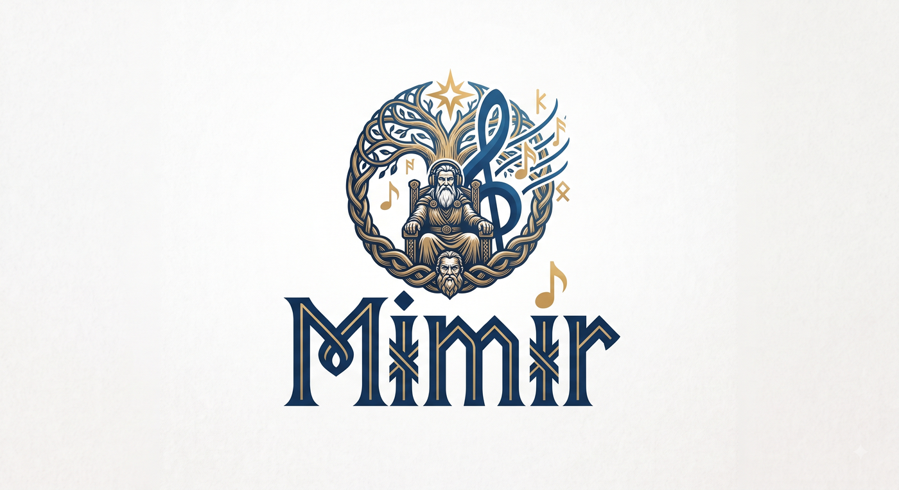

# Mimir

> Cross-platform music catalog and player.
> Desktop only (Windows / Linux / macOS). All data local by default.

## What it is

A desktop music catalog and player that watches folders, extracts/enriches metadata, organizes tracks into albums/artists/genres/folders/playlists, and plays them.

## Mythology

**Mímir** — Norse figure of wisdom and memory, keeper of the well at the root of Yggdrasil from which Odin drank for knowledge.

## Documentation

- [Requirements (PRD)](docs/Requirements.md)
- [Architecture](docs/Architecture.md)
- [Technical Decisions](docs/TechnicalDecisions.md)
- [Plan](docs/Plan.md)
- [Contributing](CONTRIBUTING.md)

## Toolchain

Pinned to **Rust 1.97.1** via `rust-toolchain.toml`. See
[Contributing](CONTRIBUTING.md#toolchain) for details.

## Status

MVP walking skeleton (S0) complete — ingests, indexes, browses (Tracks / Albums /
**Artists** / Genres / Years / Folders), searches, and plays back. Release
`0.1.0` tagged; Linux AppImage/.deb via `cargo tauri build`.

Tier 1 (library depth) is in flight — see [Plan](docs/Plan.md).
