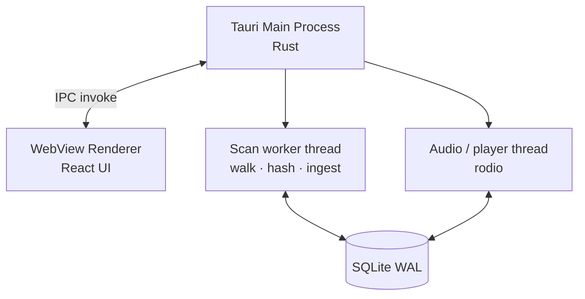
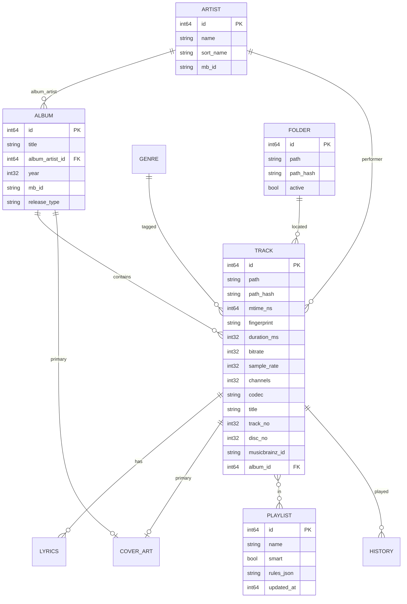
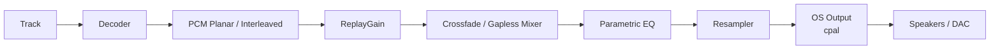
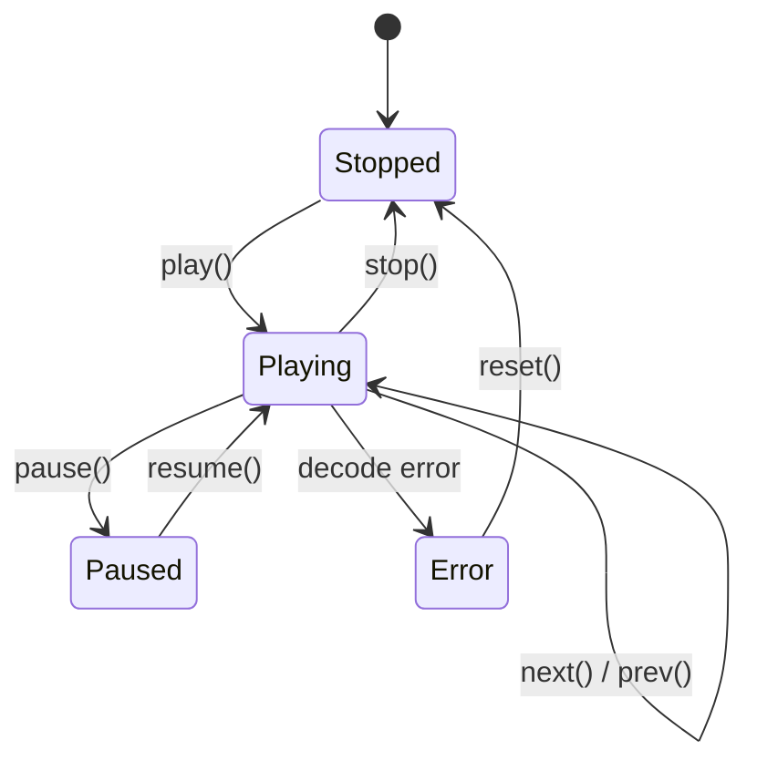
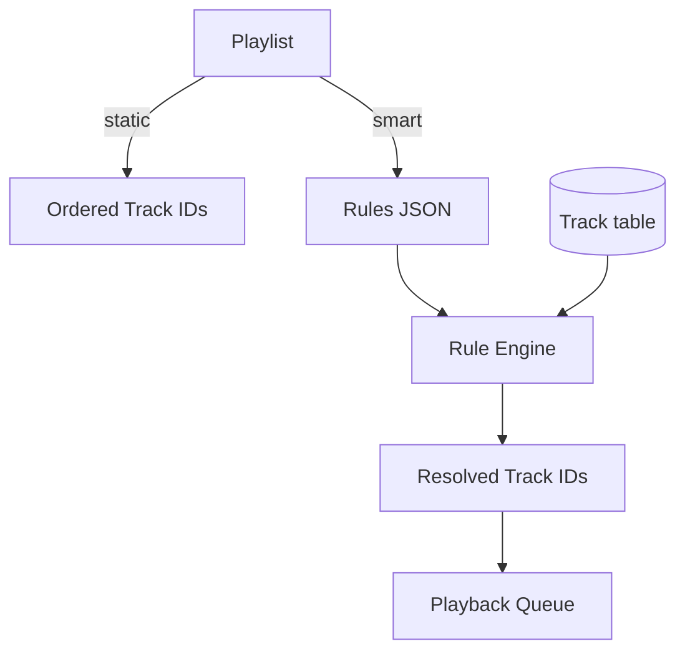
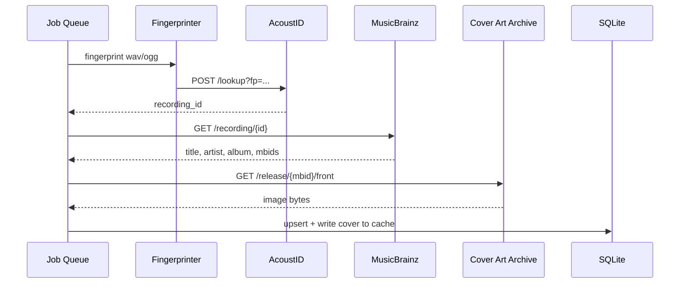
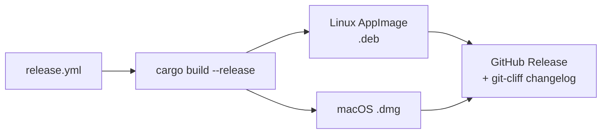

# Mimir — Architecture

> Architecture-only document. Product scope lives in [Requirements](Requirements.md).
> Tech-stack rationale and library picks live in [Technical Decisions](TechnicalDecisions.md).
> Delivery milestones and walking-skeleton MVP live in [Plan](Plan.md).

> Cross-platform music catalog and player.
> Desktop only (Windows / Linux / macOS). All data local by default.

> Index: [← back to Mimir](README.md)

---

## High-Level Architecture

```mermaid
flowchart LR
    subgraph FS[Filesystem]
        F1[/Watched Folder A/]
        F2[/Watched Folder B/]
    end

    subgraph CORE[Rust Core]
        W[File Watcher<br/>notify]
        S[Scanner<br/>std thread + mpsc]
        M[Metadata Extractor<br/>lofty]
        DB[(SQLite + FTS5<br/>WAL)]
        ART[Cover Art<br/>mimircover:// protocol]
    end

    subgraph CORE_FUT[Tier 4 (not yet implemented)]
        FP[Fingerprinter<br/>Chromaprint]
        E[Enrichment<br/>MusicBrainz · AcoustID · CAA]
    end

    subgraph AUDIO[Audio Engine]
        DEC[Decoder<br/>symphonia]
        RG[ReplayGain volume<br/>applied on track start]
        OUT[Output<br/>rodio/cpal]
        MAC[CoreAudio]
        LIN[ALSA / Pulse / PipeWire]
        WIN[WASAPI]
    end

    subgraph UI[Desktop UI]
        BROWSE[Library Browsing<br/>React views]
        PLAY[Now Playing]
        EDIT[Track Editor<br/>DB-only]
    end

    F1 --> W
    F2 --> W
    W --> S
    S --> M
    M --> DB
    M -.-> ART
    M -.-> FP -.-> E -.-> DB
    DB --> BROWSE
    DB --> PLAY
    DEC --> RG --> OUT
    OUT --> MAC
    OUT --> LIN
    OUT --> WIN
    DB --> DEC
```

### Process Model



- One Tauri main process (Rust), one WebView renderer (React), one scan-worker thread (`std::thread` + `mpsc`), and the audio worker (`rodio`) — all share the SQLite DB.
- No async runtime; workers are plain OS threads.

---

## Data Model (ERD)



---

## Modules

| Module | Responsibility |
|--------|----------------|
| `core::watcher` | Cross-platform FS events (`notify` + debouncer) |
| `core::scanner` | Walk dirs, hash, dedupe |
| `core::metadata` | Tag extraction (`lofty`) & heuristics; cover/lyrics sidecars |
| `core::db` | SQLite schema, migrations, FTS5, cover art, lyrics |
| `core::query` | Read-side views (tracks/albums/artists/genres/years/folders/search) |
| `telemetry` | File-rotating logger (`crates/telemetry`) |
| `audio::decode` | Decode to PCM (`symphonia`) |
| `audio::gain` | ReplayGain dB → linear volume |
| `audio::eq` | EQ prototype (not yet wired into playback) |
| `audio::player` | Playback queue + transport (`rodio`, gated on `output`) |
| `app` | Tauri host, IPC, `mimircover://` protocol |
| `ui` | React + TypeScript frontend inside Tauri (Vite/Zustand/shadcn) |

Not yet implemented (target design, Tiers 2–5): `core::fingerprint` / `core::enrich` (Chromaprint, MusicBrainz, AcoustID, Cover Art Archive), `core::playlist` (smart rules), `audio::dsp` (crossfade, parametric EQ, resampling), scrobble. See the [feature checklist](Plan.md#feature-checklist).

---

## Scoping & Ingestion

```mermaid
sequenceDiagram
    autonumber
    participant U as User
    participant W as Watcher
    participant Q as Scan Queue
    participant M as Metadata Worker
    participant FP as Fingerprinter
    participant DB as SQLite
    U->>W: add /music folder
    W->>Q: enqueue path
    Q->>M: worker picks up
    M->>DB: read embedded tags
    M-->>DB: upsert Track / Album / Artist
    M->>FP: compute fingerprint (async)
    FP-->>DB: attach fingerprint when ready
    Note over W,DB: Watcher keeps streaming events;<br/>periodic reconciliation re-scans diffs.
```

### Ingestion Sketch (Tier 4 design, not implemented)

```rust
pub struct IngestEvent {
    pub path: PathBuf,
    pub kind: EventKind,          // Created | Modified | Removed | Renamed
    pub src:  Option<PathBuf>,    // for renames
}

pub async fn handle(event: IngestEvent, pool: &WorkerPool) -> Result<()> {
    match event.kind {
        EventKind::Removed => db().mark_missing(&event.path).await,
        EventKind::Renamed => db().move_track(event.src, event.path).await,
        _ => pool.enqueue(ScanJob::new(event.path)).await,
    }
}

pub struct ScanJob { path: PathBuf }

impl ScanJob {
    pub async fn run(self) -> Result<()> {
        let meta = lofty::read(&self.path)?;
        let fp   = tokio::task::spawn_blocking({
            let p = self.path.clone();
            move || chromaprint::fingerprint(&p)
        }).await??;

        let tx = db().begin()?;
        upsert_track(&tx, &self.path, &meta)?;
        upsert_fingerprint(&tx, &fp)?;
        tx.commit()?;
        Ok(())
    }
}
```

### Watcher (actual, simplified)

```rust
use std::sync::mpsc;
use std::thread;

fn spawn_watcher(root: &Path, rx: &mut mpsc::Receiver<IngestEvent>) {
    let mut deb = notify_debouncer_full::new_debouncer(Duration::from_millis(500), None, |res| {
        // send IngestEvent into the scan thread's channel
    }).expect("watcher");
    deb.watcher().watch(root, RecursiveMode::Recursive).expect("watch");
    // park: keep the debouncer alive
    loop { let _ = rx.recv_timeout(Duration::from_secs(1)); }
}
```

---

## Database (SQLite + FTS5)

> See also: [Technical Decisions · Storage](TechnicalDecisions.md#storage) for rationale.

```sql
-- Core tables
CREATE TABLE artist (
  id        INTEGER PRIMARY KEY,
  name      TEXT NOT NULL,
  sort_name TEXT COLLATE NOCASE,
  mb_id     TEXT UNIQUE,
  UNIQUE(name)
);
CREATE INDEX artist_sort_idx ON artist(sort_name);

CREATE TABLE album (
  id              INTEGER PRIMARY KEY,
  title           TEXT NOT NULL,
  album_artist_id INTEGER REFERENCES artist(id),
  year            INTEGER,
  mb_id           TEXT UNIQUE,
  release_type    TEXT
);

CREATE TABLE track (
  id          INTEGER PRIMARY KEY,
  path        TEXT NOT NULL UNIQUE,
  path_hash   BLOB NOT NULL,
  mtime_ns    INTEGER NOT NULL,
  size_bytes  INTEGER NOT NULL,
  codec       TEXT NOT NULL,
  duration_ms INTEGER,
  sample_rate INTEGER,
  channels    INTEGER,
  bitrate     INTEGER,
  title       TEXT,
  track_no    INTEGER,
  disc_no     INTEGER,
  album_id    INTEGER REFERENCES album(id),
  fingerprint BLOB,
  mb_id       TEXT,
  missing     INTEGER NOT NULL DEFAULT 0
);

CREATE TABLE playlist (
  id          INTEGER PRIMARY KEY,
  name        TEXT NOT NULL,
  smart       INTEGER NOT NULL DEFAULT 0,
  rules_json  TEXT,
  updated_at  INTEGER NOT NULL
);

CREATE TABLE playlist_track (
  playlist_id INTEGER NOT NULL REFERENCES playlist(id) ON DELETE CASCADE,
  position    INTEGER NOT NULL,
  track_id    INTEGER NOT NULL REFERENCES track(id) ON DELETE CASCADE,
  PRIMARY KEY (playlist_id, position)
);

-- Full-text search
CREATE VIRTUAL TABLE track_fts USING fts5(
  title, album, artist, genre, composer,
  content='track', content_rowid='id', tokenize='unicode61 remove_diacritics'
);

-- Triggers to keep FTS in sync
CREATE TRIGGER track_ai AFTER INSERT ON track BEGIN
  INSERT INTO track_fts(rowid, title, album, artist, genre, composer)
  VALUES (new.id,
          new.title,
          (SELECT title   FROM album WHERE id = new.album_id),
          (SELECT name    FROM artist WHERE id IN
             (SELECT album_artist_id FROM album WHERE id = new.album_id)),
          NULL, NULL);
END;
```

### Search Query Example

```sql
-- artist:"foo" year:>2000 genre:rock -live
SELECT t.id, t.title, a.title AS album, ar.name AS artist
FROM track_fts f
JOIN track t ON t.id = f.rowid
JOIN album a ON a.id = t.album_id
JOIN artist ar ON ar.id = a.album_artist_id
WHERE track_fts MATCH 'artist:foo year:>2000 genre:rock -live'
ORDER BY rank
LIMIT 50;
```

---

## Audio Pipeline



### Audio Engine (Tier 2 design, not implemented)

```rust
pub struct AudioEngine {
    pub queue:     PlaybackQueue,
    pub decoder:   DecoderChain,
    pub dsp:       DspPipeline,
    pub output:    Box<dyn OutputSink>,
    pub config:    AudioConfig,
}

impl AudioEngine {
    pub async fn play(&mut self, track_id: TrackId) -> Result<()> {
        let path = db().track_path(track_id)?;
        let src  = self.decoder.open(&path)?;
        self.dsp.apply_replaygain(src.replay_gain());

        let stream = self.output.open_stream(self.config)?;
        let mixer  = self.dsp.into_mixer(stream);

        tokio::spawn(async move { src.pipe_to(mixer).await });
        self.queue.push(track_id);
        Ok(())
    }
}

pub trait OutputSink: Send {
    fn open_stream(&mut self, cfg: AudioConfig) -> Result<Stream>;
}

#[cfg(target_os = "macos")]   type OsSink = CoreAudioSink;
#[cfg(target_os = "windows")] type OsSink = WasapiSink;
#[cfg(target_os = "linux")]   type OsSink = AlsaOrPulseSink;
```

### Playback State



---

## Playlists (Tier 3 design, not implemented)



### Smart Playlist Rules Schema (Tier 3 design)

```rust
#[derive(Serialize, Deserialize)]
pub struct SmartRules {
    pub combinator: Combinator,           // And | Or
    pub conditions: Vec<Condition>,
    pub order:      Vec<SortKey>,
    pub limit:      Option<u32>,
}

#[derive(Serialize, Deserialize)]
pub struct Condition {
    pub field:    Field,                   // Artist | Album | Genre | Year | PlayCount | Rating | ...
    pub op:       Op,                      // Eq | Ne | Gt | Lt | Contains | NotContains | In | ...
    pub value:    Value,                   // string | int | list
    pub group:    Option<Combinator>,      // nested groups
}
```

### Rule Evaluation (pseudo)

```rust
fn matches(t: &Track, c: &Condition) -> bool {
    use Op::*;
    let field = c.field.resolve(t);
    match c.op {
        Eq           => field == c.value,
        Contains     => field.to_string().contains_ignore_case(&c.value),
        Gt           => field.as_num() >  c.value.as_num(),
        In           => c.value.as_list().iter().any(|v| v == &field),
        _ => unimplemented!(),
    }
}
```

---

## Enrichment (Tier 4 design, not implemented)



---

## UI (Tauri host + React frontend)

```mermaid
flowchart LR
    subgraph Views
        TRK[Tracks]
        ALB[Albums]
        ART[Artists]
        GEN[Genres]
        YRS[Years]
        FOL[Folders]
    end

    subgraph State
        Z[Zustand store<br/>src/lib/store.ts]
        IPC[typed invoke() wrappers<br/>src/lib/ipc.ts]
    end

    TRK --> IPC --> Z
    ALB --> IPC
    ART --> IPC
    GEN --> IPC
    YRS --> IPC
    FOL --> IPC
```

- Built with Vite + TypeScript; Tailwind + shadcn/ui components.
- IPC via Tauri `invoke()` commands (typed wrappers in `src/lib/ipc.ts`); album cover bytes streamed over the `mimircover://` custom protocol rather than IPC.
- Not yet implemented: virtualized lists for ≥ 10k rows, native menu + global transport hotkeys, Playlists/Settings pages (see the [feature checklist](Plan.md#feature-checklist)).

---

## Observability & Errors

`crates/app/src/error.rs` defines the single IPC error type (serializable so the frontend gets a structured failure, not a panic):

```rust
#[derive(Debug, Error, Serialize)]
#[serde(tag = "kind", content = "message")]
pub enum AppError {
    #[error("io: {0}")]            Io(String),
    #[error("sqlite: {0}")]        Sqlite(String),
    #[error("decode: {0}")]        Decode(String),
    #[error("path not found: {0}")] PathNotFound(String),
    #[error("internal: {0}")]       Internal(String),
}
```

Logging is handled by `crates/telemetry` (mimir-telemetry): a file-rotating logger writing to `$XDG_STATE_HOME/var/log/mimir.log` (5 MiB rotation, 3 generations). The webview can't reach the file logger directly, so its `console.*` calls are bridged through the `app_log` IPC command. Scan/ingest progress is surfaced to the UI via `scan:done` / `scan:error` events (there is no `db_event_log` table).

---

## Build & Packaging



`.github/workflows/release.yml` builds a Linux (AppImage + .deb) and macOS (.dmg) matrix on a `v*` tag, then publishes them as a GitHub release with a git-cliff changelog.

> **Current status:** `0.2.0` ships Linux AppImage + .deb and macOS .dmg via `tauri build`; CI also produces a stripped `mimir-linux-x86_64` binary on every push. Windows MSI, Flatpak, signing/notarization, and auto-update are deferred to Tier 6 — see the [feature checklist](Plan.md#feature-checklist).
