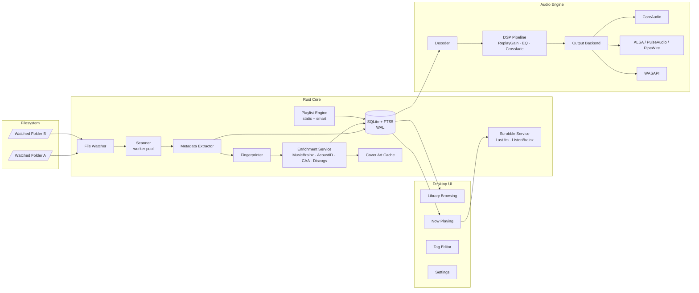
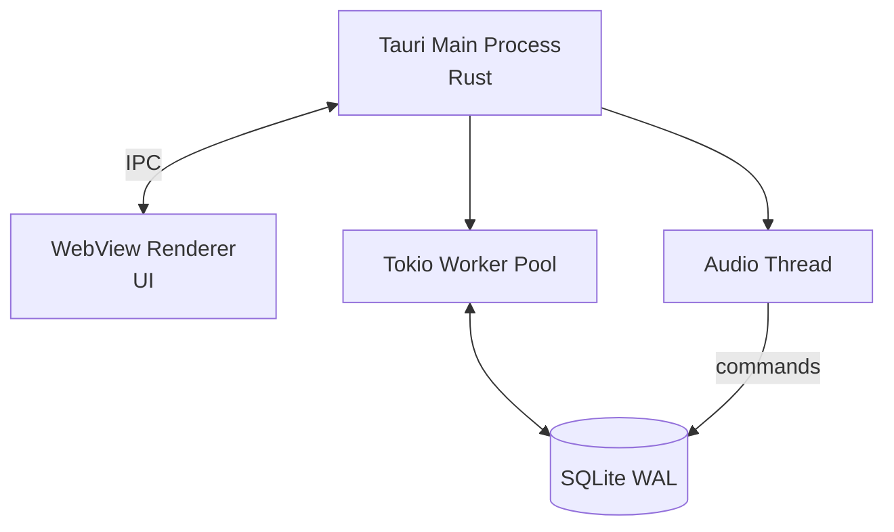
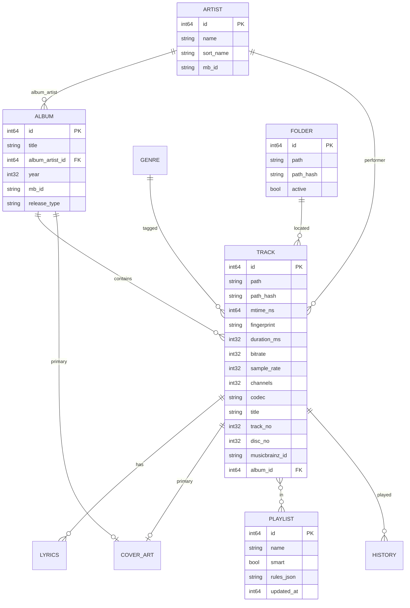
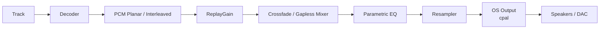
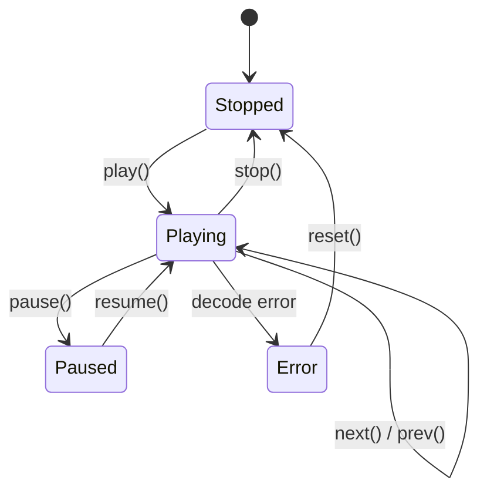
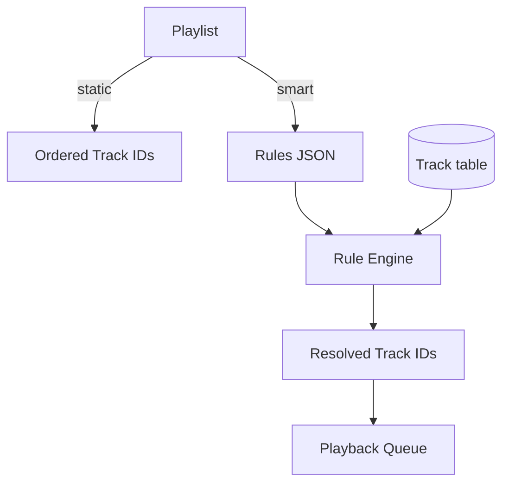
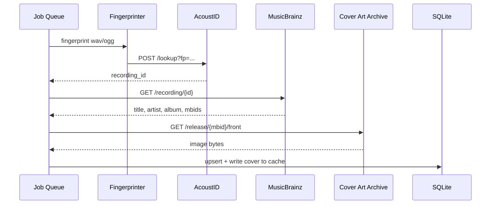
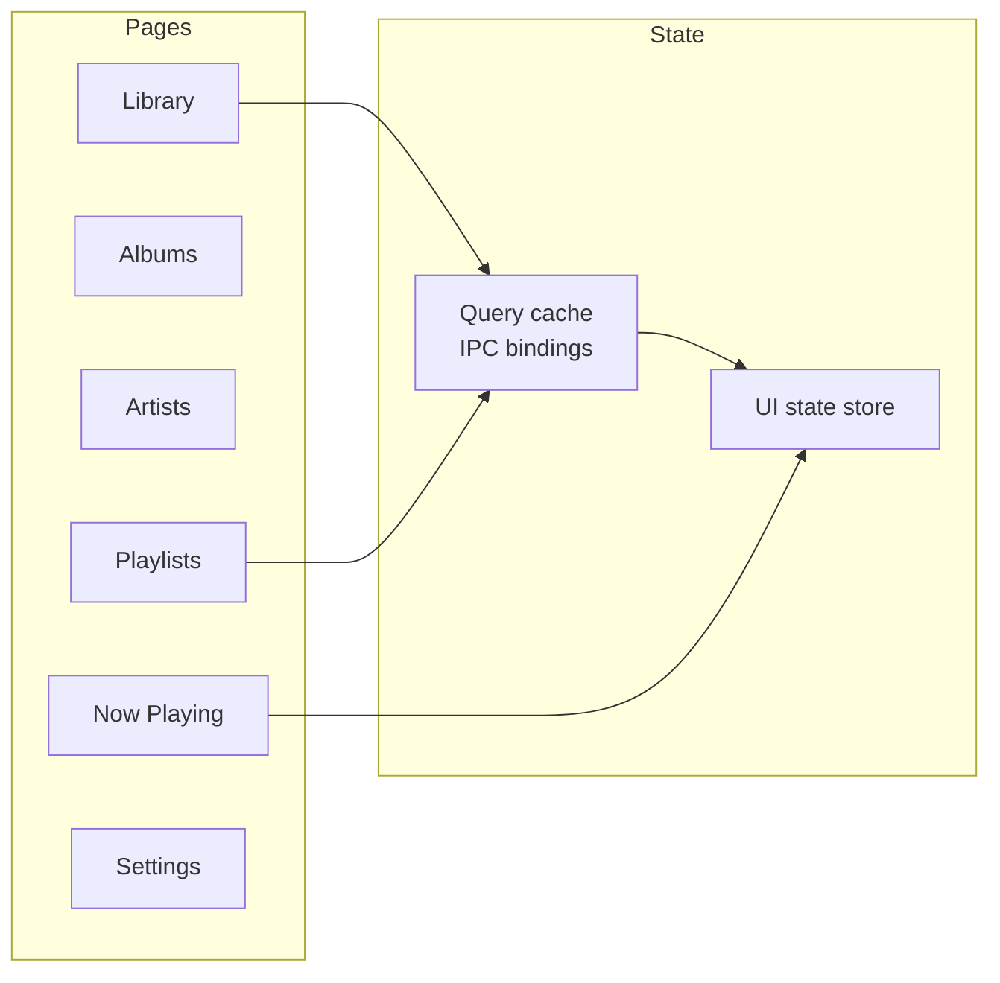
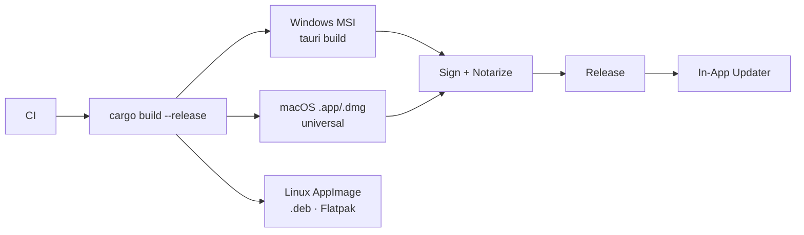

# Mimir — Architecture

> Architecture-only document. Product scope lives in [Requirements](Requirements.md).
> Tech-stack rationale and library picks live in [Technical Decisions](TechnicalDecisions.md).
> Delivery milestones and walking-skeleton MVP live in [Plan](Plan.md).

> Cross-platform music catalog and player.
> Desktop only (Windows / Linux / macOS). All data local by default.

> Index: [← back to Mimir](README.md)

---

## High-Level Architecture



### Process Model



---

## Data Model (ERD)



---

## Modules

| Module | Responsibility |
|--------|----------------|
| `core::watcher` | Cross-platform FS events |
| `core::scanner` | Walk dirs, hash, dedupe |
| `core::metadata` | Tag extraction & heuristics |
| `core::fingerprint`| Chromaprint generation |
| `core::enrich` | MusicBrainz, AcoustID, CAA, Discogs |
| `core::db` | SQLite schema, migrations, FTS |
| `core::playlist` | Static + smart playlist evaluation |
| `audio::decode` | Frame-accurate decode |
| `audio::dsp` | ReplayGain, crossfade, EQ, resample |
| `audio::output` | OS backends |
| `scrobble` | Last.fm / ListenBrainz |
| `app` | Tauri host, IPC, updater |
| `ui` | Web frontend inside Tauri |

Concrete crate candidates are listed in [Technical Decisions](TechnicalDecisions.md) (none are locked until spike validation; see [spike plan](TechnicalDecisions.md#spike-plan)).

---

## Scoping & Ingestion

```mermaid
sequenceDiagram
    autonumber
    participant U as User
    participant W as Watcher
    participant Q as Scan Queue
    participant M as Metadata Worker
    participant FP as Fingerprinter
    participant DB as SQLite
    U->>W: add /music folder
    W->>Q: enqueue path
    Q->>M: worker picks up
    M->>DB: read embedded tags
    M-->>DB: upsert Track / Album / Artist
    M->>FP: compute fingerprint (async)
    FP-->>DB: attach fingerprint when ready
    Note over W,DB: Watcher keeps streaming events;<br/>periodic reconciliation re-scans diffs.
```

### Ingestion Sketch (illustrative — not locked)

```rust
pub struct IngestEvent {
    pub path: PathBuf,
    pub kind: EventKind,          // Created | Modified | Removed | Renamed
    pub src:  Option<PathBuf>,    // for renames
}

pub async fn handle(event: IngestEvent, pool: &WorkerPool) -> Result<()> {
    match event.kind {
        EventKind::Removed => db().mark_missing(&event.path).await,
        EventKind::Renamed => db().move_track(event.src, event.path).await,
        _ => pool.enqueue(ScanJob::new(event.path)).await,
    }
}

pub struct ScanJob { path: PathBuf }

impl ScanJob {
    pub async fn run(self) -> Result<()> {
        let meta = lofty::read(&self.path)?;
        let fp   = tokio::task::spawn_blocking({
            let p = self.path.clone();
            move || chromaprint::fingerprint(&p)
        }).await??;

        let tx = db().begin()?;
        upsert_track(&tx, &self.path, &meta)?;
        upsert_fingerprint(&tx, &fp)?;
        tx.commit()?;
        Ok(())
    }
}
```

### Watcher Skeleton (illustrative)

```rust
use notify::{Watcher, RecursiveMode, EventKind};

pub fn spawn_watcher(root: PathBuf, tx: mpsc::Sender<IngestEvent>) {
    tokio::task::spawn_blocking(move || {
        let mut w = notify_debouncer_full::new_debouncer(
            Duration::from_millis(500), None, move |res| {
                if let Ok(events) = res {
                    for e in events { let _ = tx.blocking_send(to_ingest(e)); }
                }
            }
        )?;
        w.watcher().watch(&root, RecursiveMode::Recursive)?;
        std::thread::park(); // keep alive
        Ok::<(), anyhow::Error>(())
    });
}
```

---

## Database (SQLite + FTS5)

> See also: [Technical Decisions · Storage](TechnicalDecisions.md#storage) for rationale.

```sql
-- Core tables
CREATE TABLE artist (
  id        INTEGER PRIMARY KEY,
  name      TEXT NOT NULL,
  sort_name TEXT COLLATE NOCASE,
  mb_id     TEXT UNIQUE,
  UNIQUE(name)
);
CREATE INDEX artist_sort_idx ON artist(sort_name);

CREATE TABLE album (
  id              INTEGER PRIMARY KEY,
  title           TEXT NOT NULL,
  album_artist_id INTEGER REFERENCES artist(id),
  year            INTEGER,
  mb_id           TEXT UNIQUE,
  release_type    TEXT
);

CREATE TABLE track (
  id          INTEGER PRIMARY KEY,
  path        TEXT NOT NULL UNIQUE,
  path_hash   BLOB NOT NULL,
  mtime_ns    INTEGER NOT NULL,
  size_bytes  INTEGER NOT NULL,
  codec       TEXT NOT NULL,
  duration_ms INTEGER,
  sample_rate INTEGER,
  channels    INTEGER,
  bitrate     INTEGER,
  title       TEXT,
  track_no    INTEGER,
  disc_no     INTEGER,
  album_id    INTEGER REFERENCES album(id),
  fingerprint BLOB,
  mb_id       TEXT,
  missing     INTEGER NOT NULL DEFAULT 0
);

CREATE TABLE playlist (
  id          INTEGER PRIMARY KEY,
  name        TEXT NOT NULL,
  smart       INTEGER NOT NULL DEFAULT 0,
  rules_json  TEXT,
  updated_at  INTEGER NOT NULL
);

CREATE TABLE playlist_track (
  playlist_id INTEGER NOT NULL REFERENCES playlist(id) ON DELETE CASCADE,
  position    INTEGER NOT NULL,
  track_id    INTEGER NOT NULL REFERENCES track(id) ON DELETE CASCADE,
  PRIMARY KEY (playlist_id, position)
);

-- Full-text search
CREATE VIRTUAL TABLE track_fts USING fts5(
  title, album, artist, genre, composer,
  content='track', content_rowid='id', tokenize='unicode61 remove_diacritics'
);

-- Triggers to keep FTS in sync
CREATE TRIGGER track_ai AFTER INSERT ON track BEGIN
  INSERT INTO track_fts(rowid, title, album, artist, genre, composer)
  VALUES (new.id,
          new.title,
          (SELECT title   FROM album WHERE id = new.album_id),
          (SELECT name    FROM artist WHERE id IN
             (SELECT album_artist_id FROM album WHERE id = new.album_id)),
          NULL, NULL);
END;
```

### Search Query Example

```sql
-- artist:"foo" year:>2000 genre:rock -live
SELECT t.id, t.title, a.title AS album, ar.name AS artist
FROM track_fts f
JOIN track t ON t.id = f.rowid
JOIN album a ON a.id = t.album_id
JOIN artist ar ON ar.id = a.album_artist_id
WHERE track_fts MATCH 'artist:foo year:>2000 genre:rock -live'
ORDER BY rank
LIMIT 50;
```

---

## Audio Pipeline



### Audio Engine Skeleton (illustrative)

```rust
pub struct AudioEngine {
    pub queue:     PlaybackQueue,
    pub decoder:   DecoderChain,
    pub dsp:       DspPipeline,
    pub output:    Box<dyn OutputSink>,
    pub config:    AudioConfig,
}

impl AudioEngine {
    pub async fn play(&mut self, track_id: TrackId) -> Result<()> {
        let path = db().track_path(track_id)?;
        let src  = self.decoder.open(&path)?;
        self.dsp.apply_replaygain(src.replay_gain());

        let stream = self.output.open_stream(self.config)?;
        let mixer  = self.dsp.into_mixer(stream);

        tokio::spawn(async move { src.pipe_to(mixer).await });
        self.queue.push(track_id);
        Ok(())
    }
}

pub trait OutputSink: Send {
    fn open_stream(&mut self, cfg: AudioConfig) -> Result<Stream>;
}

#[cfg(target_os = "macos")]   type OsSink = CoreAudioSink;
#[cfg(target_os = "windows")] type OsSink = WasapiSink;
#[cfg(target_os = "linux")]   type OsSink = AlsaOrPulseSink;
```

### Playback State



---

## Playlists



### Smart Playlist Rules Schema (illustrative)

```rust
#[derive(Serialize, Deserialize)]
pub struct SmartRules {
    pub combinator: Combinator,           // And | Or
    pub conditions: Vec<Condition>,
    pub order:      Vec<SortKey>,
    pub limit:      Option<u32>,
}

#[derive(Serialize, Deserialize)]
pub struct Condition {
    pub field:    Field,                   // Artist | Album | Genre | Year | PlayCount | Rating | ...
    pub op:       Op,                      // Eq | Ne | Gt | Lt | Contains | NotContains | In | ...
    pub value:    Value,                   // string | int | list
    pub group:    Option<Combinator>,      // nested groups
}
```

### Rule Evaluation (pseudo)

```rust
fn matches(t: &Track, c: &Condition) -> bool {
    use Op::*;
    let field = c.field.resolve(t);
    match c.op {
        Eq           => field == c.value,
        Contains     => field.to_string().contains_ignore_case(&c.value),
        Gt           => field.as_num() >  c.value.as_num(),
        In           => c.value.as_list().iter().any(|v| v == &field),
        _ => unimplemented!(),
    }
}
```

---

## Enrichment



---

## UI (Tauri host + Web frontend)



- IPC via Tauri `invoke()` commands; binary payloads streamed over Tauri channels.
- Virtualized lists for libraries ≥ 10k rows.
- Native menu + global hotkeys for transport.

---

## Observability & Errors

```rust
#[derive(thiserror::Error, Debug)]
pub enum AppError {
    #[error("io: {0}")]            Io(#[from] std::io::Error),
    #[error("db: {0}")]            Db(#[from] rusqlite::Error),
    #[error("decode: {0}")]        Decode(String),
    #[error("metadata: {0}")]      Metadata(String),
    #[error("enrich: {0}")]        Enrich(String),
    #[error("audio output: {0}")]  Audio(String),
}

pub fn init_tracing() {
    use tracing_subscriber::{layer::SubscriberExt, EnvFilter};
    tracing_subscriber::registry()
        .with(EnvFilter::try_from_default_env().unwrap_or_else(|_| "info".into()))
        .with(tracing_subscriber::fmt::layer().with_target(false))
        .init();
}
```

Log levels routed per module; enrichment/scan errors persisted to a `db_event_log` table for retry.

---

## Build & Packaging



```yaml
# .github/workflows/release.yml (excerpt)
- name: Build (windows-latest)
  run: cargo tauri build --target x86_64-pc-windows-msvc
- name: Build (macos-latest, universal)
  run: cargo tauri build --target universal-apple-darwin
- name: Build (ubuntu-latest)
  run: cargo tauri build --target x86_64-unknown-linux-gnu
```

> **Phase 0 status:** the pipeline currently ships a Linux-only `cargo build --release` artifact from a pure Cargo workspace skeleton (no Tauri yet). See [Plan · Phase 0 — CI Bootstrap](Plan.md#phase-0--ci-bootstrap). The full Tauri matrix (AppImage / .deb / Flatpak / MSI / .dmg) and signing/notarization are deferred to Tier 6.
